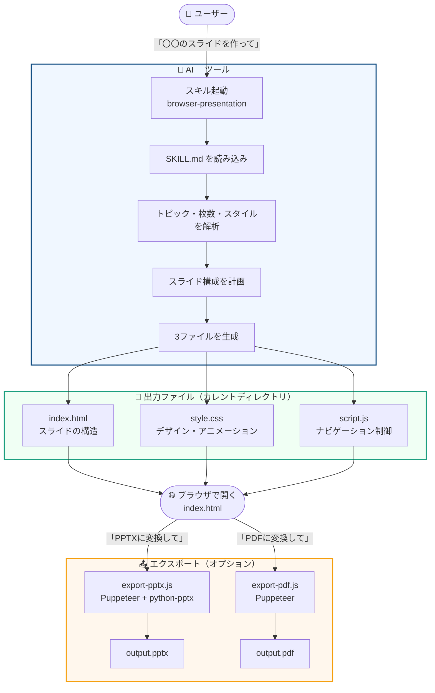

# browser-presentation

このリポジトリは **Claude Code** および **IBM Bob** 向けに提供するスキルです。  
トピックやアウトラインを渡すと、ブラウザで動くスライドショーを **3ファイル**（`index.html` / `style.css` / `script.js`）で自動生成します。

スライドの生成だけでなく、PPTX(画像)・PDF へのエクスポートにも対応しています。

## 動画

(ご参考動画: 画像をクリックすると動画のリンクに飛びます)

<a href="https://www.youtube.com/watch?v=ZEPLxOnUgyY" target="_blank">
  
</a>


## 使用前提環境

本スキルは以下の AI ツールのスキル機能として動作します。

| ツール | 提供元 | 動作確認済みバージョン |
|---|---|---|
| **Claude Code** | Anthropic | Claude Sonnet / Opus 系 |
| **IBM Bob** | IBM | Bob（スキル対応版） |

> [!IMPORTANT]
> このスキルは AI ツールのスキル読み込み機能を使用します。  
> スキルフォルダを正しいディレクトリに配置してから使用してください。

---

## インストール（スキルフォルダの配置）

本スキルを AI ツールで使用するには、スキルディレクトリにフォルダを配置する必要があります。

Git から直接ダウンロード（クローン）して配置する方法、またはローカルにあるフォルダをコピーする方法のいずれかで配置してください。


### 方法 1: Git から直接ダウンロードして配置（推奨）

Git を使用して、お使いの AI ツールのスキルディレクトリへ直接ダウンロードします。

#### Claude Code

```bash
# グローバル（全プロジェクトで使用）
git clone https://<URL>/browser-presentation.git ~/.claude/skills/browser-presentation

# プロジェクトローカル（現在のプロジェクトのみで使用）
git clone https://<URL>/browser-presentation.git ./.claude/skills/browser-presentation
```

#### IBM Bob

```bash
# グローバル（全プロジェクトで使用）
git clone https://<URL>/browser-presentation.git ~/.bob/skills/browser-presentation

# プロジェクトローカル（現在のプロジェクトのみで使用）
git clone https://<URL>/browser-presentation.git ./.bob/skills/browser-presentation
```

### 方法 2: ローカルのフォルダをコピーして配置

すでにリポジトリをローカルにダウンロード済みの場合は、以下のコマンドでコピーして配置できます。

#### Claude Code

| スコープ | 配置先 |
|---|---|
| **グローバル**（全プロジェクトで使用） | `~/.claude/skills/browser-presentation/` |
| **プロジェクトローカル** | `./.claude/skills/brow ser-presentation/` |

```bash
# グローバルにインストールする場合
cp -r browser-presentation-internal ~/.claude/skills/browser-presentation

# プロジェクトローカルにインストールする場合
cp -r browser-presentation-internal ./.claude/skills/browser-presentation
```

### IBM Bob

| スコープ | 配置先 |
|---|---|
| **グローバル**（全プロジェクトで使用） | `~/.bob/skills/browser-presentation/` |
| **プロジェクトローカル** | `./.bob/skills/browser-presentation/` |

```bash
# グローバルにインストールする場合
cp -r browser-presentation-internal ~/.bob/skills/browser-presentation

# プロジェクトローカルにインストールする場合
cp -r browser-presentation-internal ./.bob/skills/browser-presentation
```

---

## 出力ファイル

| ファイル | 役割 |
|---|---|
| `index.html` | スライドのマークアップとレイアウト |
| `script.js` | ナビゲーション・キーボード操作・トランジション制御 |
| `style.css` | ビジュアルデザインとスライドアニメーション |


## トリガー例

以下のような指示で自動的にこのスキルが起動します。
スキル名を明示して呼び出すと確実です。

#### Claude Code

```
browser-presentation スキルを使って〇〇のスライドを作って
/browser-presentation 〇〇についてのプレゼンを作って
```

#### IBM Bob

```
「browser-presentation」を使用して〇〇のスライドを作って
browser-presentation スキルで〇〇についてのプレゼンを作成して
```

---

## ブラウザ・プレゼンテーション機能

- **前へ / 次へ**ボタンによるナビゲーション
- キーボード操作（← → ↑ ↓ Space）
- スライド番号表示（例: `3 / 8`）
- CSS `opacity + transform` によるスムーズなトランジション
- 最初・最後のスライドでボタンを自動無効化
- モダンなデザイン（グラデーション・シャドウ・ホバーエフェクト）をデフォルト適用
- ブラウザの「印刷 → PDF 保存」で各スライドを 1 ページずつ出力する `@media print` 対応

## 処理フロー



## 必要なモジュール

エクスポート機能を使用するには、以下のモジュールが必要です。

### Node.js — Puppeteer

`export-pptx.js` と `export-pdf.js` の両方が Puppeteer を使用してブラウザを操作します。  
スクリプトは `@mermaid-js/mermaid-cli` に同梱された Puppeteer を参照しているため、以下のコマンドでインストールしてください。

```bash
npm install -g @mermaid-js/mermaid-cli
```

> [!WARNING]
> **スクリプト内の Puppeteer パスは環境依存です。**  
> `export-pptx.js` と `export-pdf.js` の先頭にある `require(...)` のパスは、Node.js のバージョンマネージャーによって異なります。  
> 実行前に自環境のパスを確認し、必要に応じてスクリプトを修正してください。

#### Puppeteer パスの確認方法

以下のコマンドで自環境の実際のパスを確認できます。

```bash
find $(npm root -g) -path '*/mermaid-cli/node_modules/puppeteer' -maxdepth 6 -type d 2>/dev/null | head -1
```

#### バージョンマネージャー別のパス例

| Node.js 管理方法 | Puppeteer の `require()` パス |
|---|---|
| **Homebrew** (macOS) | `/opt/homebrew/lib/node_modules/@mermaid-js/mermaid-cli/node_modules/puppeteer` |
| **Volta** (macOS) | `/Users/<username>/.volta/tools/image/packages/@mermaid-js/mermaid-cli/lib/node_modules/@mermaid-js/mermaid-cli/node_modules/puppeteer` |
| **nvm** (macOS/Linux) | `/Users/<username>/.nvm/versions/node/<version>/lib/node_modules/@mermaid-js/mermaid-cli/node_modules/puppeteer` |
| **Windows (グローバル npm)** | `C:\Users\<username>\AppData\Roaming\npm\node_modules\@mermaid-js\mermaid-cli\node_modules\puppeteer` |

#### スクリプトの修正箇所

`export-pptx.js` と `export-pdf.js` の両方、先頭の `require()` 行を自環境のパスに書き換えます。

```js
// 修正前（Homebrew 環境用）
const puppeteer = require('/opt/homebrew/lib/node_modules/@mermaid-js/mermaid-cli/node_modules/puppeteer');

// 修正後（Volta 環境の例）
const puppeteer = require('/Users/<username>/.volta/tools/image/packages/@mermaid-js/mermaid-cli/lib/node_modules/@mermaid-js/mermaid-cli/node_modules/puppeteer');
```

### Python — python-pptx

`export-pptx.js` はスライド画像を `.pptx` に組み立てるために Python の `python-pptx` を使用します。

```bash
pip install python-pptx
```

または、仮想環境を使う場合:

```bash
python3 -m venv .venv
source .venv/bin/activate
pip install python-pptx
```

### 動作確認済み環境

| ツール | バージョン（推奨） |
|---|---|
| Node.js | v18 以上 |
| Python | 3.8 以上 |
| `@mermaid-js/mermaid-cli` | 11.15.0（動作確認済み） |
| `python-pptx` | 0.6 以上 |

### 💡 モジュール導入が不安な方へ — サンドボックス環境で実行する

ローカルへのインストールが不安な場合は、**Claude または IBM Bob のサンドボックス環境**で実行をご検討ください。サンドボックス内ではモジュールのインストールが隔離されるため、手元の環境を汚染しません。

> [!NOTE]
> サンドボックス環境ではセッション終了後にインストールしたモジュールは破棄されます。次回実行時に再インストールが必要になる場合があります。

---

## エクスポート

### PPTX

Puppeteer で各スライドをスクリーンショットし、python-pptx で `.pptx` に変換します。HTML/CSS のデザインがそのまま画像として保存されます。

#### Claude Code

```bash
node ~/.claude/skills/browser-presentation/export-pptx.js index.html output.pptx
```

#### IBM Bob

```bash
node ~/.bob/skills/browser-presentation/export-pptx.js index.html output.pptx
```

### PDF

Puppeteer の `page.pdf()` でヘッダー・フッターなしの PDF を生成します。

#### Claude Code

```bash
node ~/.claude/skills/browser-presentation/export-pdf.js index.html output.pdf
```

#### IBM Bob

```bash
node ~/.bob/skills/browser-presentation/export-pdf.js index.html output.pdf
```


## ファイル構成

```
skills/
├── SKILL.md          # スキル定義（Claude が読む指示書）
├── export-pptx.js    # PPTX エクスポートスクリプト
└── export-pdf.js     # PDF エクスポートスクリプト
```

## スタイルバリエーション

| スタイル指定 | 適用内容 |
|---|---|
| ダーク / dark mode | 濃色背景・白テキスト・カラーアクセント |
| コーポレート / formal | ブルーグレー系・セリフ見出し・アニメーション控えめ |
| ボールド / colorful | グラデーション背景・大きな文字・鮮やかなアクセント |
| ミニマル / minimal | 白背景・細いボーダー・アニメーション最小限 |
| 日本語コンテンツ | `lang="ja"` + Noto Sans JP |

---

## ⚠️ 免責事項 / Disclaimer

本スキルは **"As Is"（現状有姿）** で提供されます。

> [!WARNING]
> - 動作は Claude Code・IBM Bob それぞれのバージョンや環境設定に依存します。
> - Puppeteer のパス、Python のバージョン、モジュールの互換性など、**ご自身の環境での動作確認を実施することを強く推奨します**。
> - 本スキルの使用によって生じたいかなる問題・損害についても、提供者は責任を負いません。

動作確認は以下の手順で行うことを推奨します。

1. スキルフォルダを正しいディレクトリに配置する
2. AI ツールを起動し、スキルが正しく読み込まれることを確認する
3. サンプルトピックでスライドを 1 件生成し、`index.html` がブラウザで表示されることを確認する
4. エクスポート機能を使用する場合は、必要なモジュールをインストールしたうえで動作を確認する
