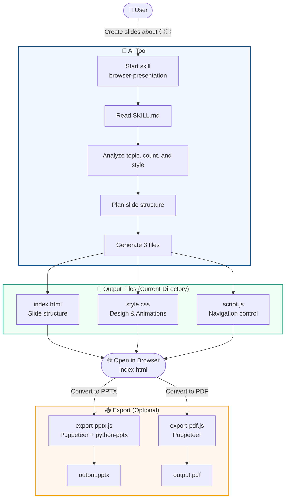

# browser-presentation

This repository provides a skill for **Claude Code** and **IBM Bob**.  
By passing a topic and outline, it automatically generates a browser-based slideshow consisting of **3 files** (`index.html` / `style.css` / `script.js`).

It not only generates slides but also supports exporting to PPTX (images) and PDF.

## Video

(Reference video: Click the image to jump to the video link)

<a href="https://www.youtube.com/watch?v=ZEPLxOnUgyY" target="_blank">
  
</a>


## Prerequisites

This skill works as a skill feature for the following AI tools.

| Tool | Provider | Verified Version |
|---|---|---|
| **Claude Code** | Anthropic | Claude Sonnet / Opus series |
| **IBM Bob** | IBM | Bob (Skill supported version) |

> [!IMPORTANT]
> This skill uses the skill loading feature of AI tools.  
> Please place the skill folder in the correct directory before use.

---

## Installation (Placing the Skill Folder)

To use this skill with your AI tool, you need to place the folder in the skill directory.

Please install by either downloading (cloning) directly from Git, or copying a local folder.


### Method 1: Download directly from Git (Recommended)

Use Git to download directly into your AI tool's skill directory.

#### Claude Code

```bash
# Global (use in all projects)
git clone https://<URL>/browser-presentation.git ~/.claude/skills/browser-presentation

# Project local (use only in the current project)
git clone https://<URL>/browser-presentation.git ./.claude/skills/browser-presentation
```

#### IBM Bob

```bash
# Global (use in all projects)
git clone https://<URL>/browser-presentation.git ~/.bob/skills/browser-presentation

# Project local (use only in the current project)
git clone https://<URL>/browser-presentation.git ./.bob/skills/browser-presentation
```

### Method 2: Copy local folder

If you have already downloaded the repository locally, you can copy and install it using the following commands.

#### Claude Code

| Scope | Location |
|---|---|
| **Global** (use in all projects) | `~/.claude/skills/browser-presentation/` |
| **Project local** | `./.claude/skills/browser-presentation/` |

```bash
# For global installation
cp -r browser-presentation-internal ~/.claude/skills/browser-presentation

# For project local installation
cp -r browser-presentation-internal ./.claude/skills/browser-presentation
```

### IBM Bob

| Scope | Location |
|---|---|
| **Global** (use in all projects) | `~/.bob/skills/browser-presentation/` |
| **Project local** | `./.bob/skills/browser-presentation/` |

```bash
# For global installation
cp -r browser-presentation-internal ~/.bob/skills/browser-presentation

# For project local installation
cp -r browser-presentation-internal ./.bob/skills/browser-presentation
```

---

## Output Files

| File | Role |
|---|---|
| `index.html` | Slide markup and layout |
| `script.js` | Navigation, keyboard controls, transition management |
| `style.css` | Visual design and slide animations |


## Trigger Examples

The following instructions will automatically launch this skill.
It is more reliable to explicitly call the skill name.

#### Claude Code

```
Use the browser-presentation skill to create slides about 〇〇
/browser-presentation Create a presentation about 〇〇
```

#### IBM Bob

```
Create slides about 〇〇 using "browser-presentation"
Create a presentation about 〇〇 with the browser-presentation skill
```

---

## Browser Presentation Features

- Navigation with **Prev / Next** buttons
- Keyboard controls (← → ↑ ↓ Space)
- Slide number display (e.g., `3 / 8`)
- Smooth transitions using CSS `opacity + transform`
- Automatically disables buttons on the first and last slides
- Applies modern design defaults (gradients, shadows, hover effects)
- Supports `@media print` to output one slide per page when using the browser's "Print → Save as PDF"

## Processing Flow



## Required Modules

To use the export features, the following modules are required.

### Node.js — Puppeteer

Both `export-pptx.js` and `export-pdf.js` use Puppeteer to control the browser.  
Since the scripts refer to the Puppeteer bundled with `@mermaid-js/mermaid-cli`, please install it with the following command.

```bash
npm install -g @mermaid-js/mermaid-cli
```

> [!WARNING]
> **The Puppeteer path in the scripts is environment-dependent.**  
> The `require(...)` paths at the top of `export-pptx.js` and `export-pdf.js` vary depending on your Node.js version manager.  
> Please verify your environment's path before execution and modify the scripts if necessary.

#### How to Check the Puppeteer Path

You can verify the actual path in your environment with the following command.

```bash
find $(npm root -g) -path '*/mermaid-cli/node_modules/puppeteer' -maxdepth 6 -type d 2>/dev/null | head -1
```

#### Path Examples by Version Manager

| Node.js Manager | Puppeteer `require()` Path |
|---|---|
| **Homebrew** (macOS) | `/opt/homebrew/lib/node_modules/@mermaid-js/mermaid-cli/node_modules/puppeteer` |
| **Volta** (macOS) | `/Users/<username>/.volta/tools/image/packages/@mermaid-js/mermaid-cli/lib/node_modules/@mermaid-js/mermaid-cli/node_modules/puppeteer` |
| **nvm** (macOS/Linux) | `/Users/<username>/.nvm/versions/node/<version>/lib/node_modules/@mermaid-js/mermaid-cli/node_modules/puppeteer` |
| **Windows (Global npm)** | `C:\Users\<username>\AppData\Roaming\npm\node_modules\@mermaid-js\mermaid-cli\node_modules\puppeteer` |

#### Script Modification Location

Rewrite the `require()` line at the top of both `export-pptx.js` and `export-pdf.js` to match your environment's path.

```js
// Before modification (for Homebrew environment)
const puppeteer = require('/opt/homebrew/lib/node_modules/@mermaid-js/mermaid-cli/node_modules/puppeteer');

// After modification (example for Volta environment)
const puppeteer = require('/Users/<username>/.volta/tools/image/packages/@mermaid-js/mermaid-cli/lib/node_modules/@mermaid-js/mermaid-cli/node_modules/puppeteer');
```

### Python — python-pptx

`export-pptx.js` uses Python's `python-pptx` to assemble slide images into `.pptx`.

```bash
pip install python-pptx
```

Or, if using a virtual environment:

```bash
python3 -m venv .venv
source .venv/bin/activate
pip install python-pptx
```

### Verified Environments

| Tool | Version (Recommended) |
|---|---|
| Node.js | v18 or later |
| Python | 3.8 or later |
| `@mermaid-js/mermaid-cli` | 11.15.0 (Verified) |
| `python-pptx` | 0.6 or later |

### 💡 For Those Concerned About Installing Modules — Run in a Sandbox Environment

If you are uneasy about installing modules locally, consider running in the **Claude or IBM Bob sandbox environment**. Since module installation is isolated within the sandbox, it will not pollute your local environment.

> [!NOTE]
> Modules installed in the sandbox environment are discarded after the session ends. Reinstallation may be required upon the next execution.

---

## Exporting

> [!NOTE]
> **Exports include the background (full page) by default.**  
> Both `export-pptx.js` and `export-pdf.js` screenshot the entire viewport — **including the `body` background (e.g. a gradient frame)** — exactly as it appears on screen.  
> To output only the `.slide-wrapper` (the white card) without the surrounding background, append `--card-only` to the command.

### PPTX

Takes a screenshot of each slide using Puppeteer, and converts them to `.pptx` using python-pptx. The HTML/CSS design is saved exactly as images.

#### Claude Code

```bash
# Default: with background (entire viewport)
node ~/.claude/skills/browser-presentation/export-pptx.js index.html output.pptx

# Card only (no background)
node ~/.claude/skills/browser-presentation/export-pptx.js index.html output.pptx --card-only
```

#### IBM Bob

```bash
node ~/.bob/skills/browser-presentation/export-pptx.js index.html output.pptx
```

### PDF

Screenshots the entire viewport of each slide and assembles a PDF, one slide per page (no browser headers or footers).

#### Claude Code

```bash
# Default: with background (entire viewport)
node ~/.claude/skills/browser-presentation/export-pdf.js index.html output.pdf

# Card only (@media print approach; background depends on print styles)
node ~/.claude/skills/browser-presentation/export-pdf.js index.html output.pdf --card-only
```

#### IBM Bob

```bash
node ~/.bob/skills/browser-presentation/export-pdf.js index.html output.pdf
```

#### Output modes

| Mode | Capture area | Use when |
|---|---|---|
| Default (with background) | Entire viewport (includes background frame) | You want it exactly as it appears on screen |
| `--card-only` | `.slide-wrapper` only | You want the card alone (no background) |


## File Structure

```
skills/
├── SKILL.md          # Skill definition (Instructions read by Claude)
├── export-pptx.js    # PPTX export script (default: with background / --card-only)
└── export-pdf.js     # PDF export script (default: with background / --card-only)
```

## Style Variations

| Style Specification | Applied Content |
|---|---|
| Dark / dark mode | Dark background, white text, color accents |
| Corporate / formal | Blue-gray tones, serif headings, subtle animations |
| Bold / colorful | Gradient backgrounds, large text, vibrant accents |
| Minimal / minimal | White background, thin borders, minimal animations |
| Japanese Content | `lang="ja"` + Noto Sans JP |

---

## ⚠️ Disclaimer

This skill is provided **"As Is"**.

> [!WARNING]
> - Behavior depends on the versions and environment settings of Claude Code and IBM Bob.
> - **We strongly recommend testing the behavior in your own environment**, including Puppeteer paths, Python versions, and module compatibility.
> - The provider assumes no responsibility for any problems or damages resulting from the use of this skill.

We recommend performing operation checks using the following steps:

1. Place the skill folder in the correct directory.
2. Start the AI tool and verify that the skill is loaded correctly.
3. Generate 1 slide using a sample topic and confirm that `index.html` displays in the browser.
4. If using export features, verify operation after installing the required modules.
